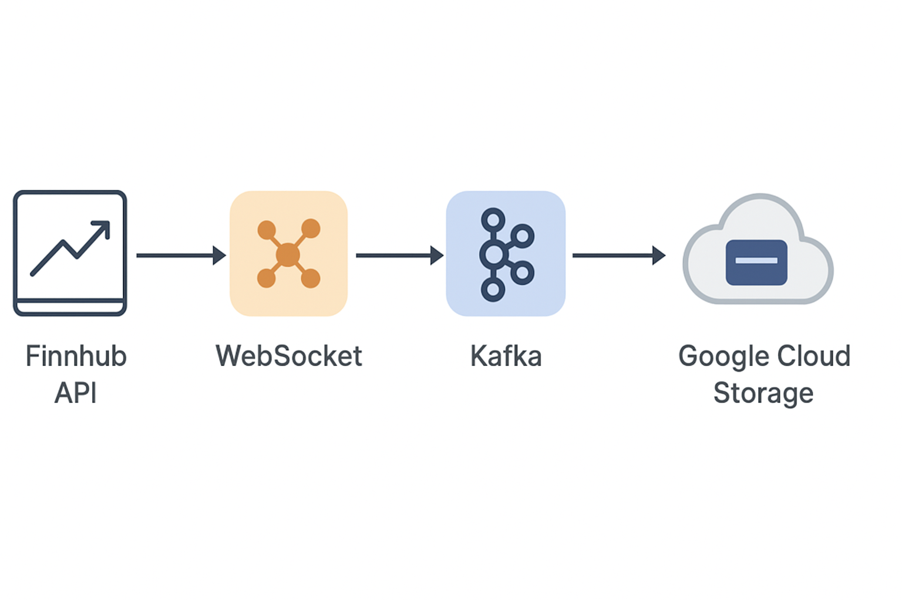

# Stock analysis
Bigdata project for a system designed to collect, store, analyze, and process stock market data

__System Architecture Pipeline:__


__Current Architecture Pipeline:__


## Project Structure
```
stock_analysis/
├── .env                          # Environment variables (API keys, Kafka configs)
├── .gitignore                    # Git ignore rules
├── requirements.txt              # Python dependencies
├── README.md                     # Project documentation
│
├── images/                       # Documentation images
│   ├── PipeLine.png             # System architecture diagram
│   └── current_pipeline.png     # Current implementation pipeline
│
├── docs/                        # Documentation
│   ├── README.md                # Docs overview
│   └── FLINK_ICEBERG_SETUP.md   # Flink + Iceberg setup guide
│
├── jars/                        # External JAR dependencies
│   ├── gcs-connector-shaded.jar # Google Cloud Storage connector for Spark
│   ├── iceberg-spark-runtime-*.jar  # Iceberg for Spark
│   └── flink/                   # Flink connectors
│       ├── flink-sql-connector-kafka-*.jar
│       └── iceberg-flink-runtime-*.jar
│
├── checkpoints/                 # Spark streaming checkpoints
│   ├── vnstock_raw/             # VNStock raw data checkpoints
│   └── vnstock_aggregates/      # VNStock aggregates checkpoints
│
├── output/                      # Local output data (for testing)
│   ├── vnstock_ohlcv/           # VNStock OHLCV output
│   └── vnstock_aggregates/      # VNStock aggregates output
│
├── scripts/                     # Main application scripts
│   ├── collect_data/            # Data collection modules
│   │   ├── StockProducer.py     # VNStock producer (polling API)
│   │   └── RealtimeStockProducer.py  # Finnhub producer (WebSocket real-time)
│   │
│   ├── constant/                # Configuration constants
│   │   ├── __init__.py
│   │   ├── stock_code_constant.py     # Vietnam stock symbols (HPG, VIC, etc.)
│   │   └── us_stock_code_constant.py  # US stock symbols (AAPL, GOOGL, etc.)
│   │
│   └── streaming/               # Spark Structured Streaming jobs
│       ├── finnhub_kafka_to_gcs.py         # Finnhub → Kafka → GCS pipeline
│       ├── finnhub_kafka_to_localStorage.py # Finnhub → Kafka → Local (testing)
│       ├── vnstock_kafka_to_gcs.py         # VNStock → Kafka → GCS pipeline
│       ├── vnstock_kafka_to_localStorage.py # VNStock → Kafka → Local (testing)
│       └── vnstock_kafka_streaming.py      # VNStock streaming (legacy)
│
├── tests/                       # Test scripts
│   ├── test_vnstock_producer.py # VNStock API integration tests
│   └── yfinance_test.py         # Yahoo Finance API tests
│
├── stock_api/                   # API utilities and demos
│   ├── demo.ipynb               # Jupyter notebook for API testing
│   └── readme.md                # Stock API documentation
│
└── references/                  # Reference materials and example projects
    ├── README.md                # References overview
    ├── BigData_Tools_Frameworks.md
    ├── Finance-Data-Ingestion-Pipeline-with-Kafka/
    ├── financial-market-data-analysis/
    └── finnhub-streaming-data-pipeline/
```

## System

### Components
- **Data Sources**: 
  - Vnstock API (Vietnam stock market - VCI/TCBS/MSN,...)
  - Finnhub API (US stock market - WebSocket real-time)
  
- **Message Broker**: Apache Kafka 3.3.2
  - Topics: `vnstock_stock`, `finnhub_stock`
  
- **Data Processing**: Apache Spark (PySpark 3.3.2) - In development

- **Storage**: TBD (Cassandra/PostgreSQL/HDFS)

### Stock Codes
Currently tracking Vietnamese stocks: `AAA`, `AAM`, `AAT`, `ABS`, `HPG`, `VIC`

## Installation
Create virtual environment  (WSL)
```
python -m venv .venv 
source .venv/bin/activate
``` 
Download libraries 
```
pip install requirements.txt
```
Download Kafka (3.3.2, to be compatible with PySpark in the previous requirements.txt)
```
wget https://archive.apache.org/dist/kafka/3.3.2/kafka_2.13-3.3.2.tgz
tar -xzf kafka_2.13-3.3.2.tgz
``` 
Download Flink 2.1.1
```
wget https://archive.apache.org/dist/flink/flink-2.1.1/flink-2.1.1-bin-scala_2.12.tgz
tar -xvf flink-1.18.1-bin-scala_2.12.tgz
```
## Collect data
We offer two methods for collecting data:
- Realtime streaming, using Finnhub API and WebSocket
- Polling, using vnstock 

Initialize Zookeeper and then Kafka broker 
```
cd ~/kafka_2.13-3.3.2
bin/zookeeper-server-start.sh config/zookeeper.properties &
bin/kafka-server-start.sh config/server.properties &
```

Run python file to collect data by API:
- realtime data by finnhub api:
```
python -m scripts.collect_data.RealtimeStockProducer
```
- batch data by vnstock api (crawl automatically after a time period):
```
python -m scripts.collect_data.StockProducer
```

Get Kafka topics 
```
cd ~/kafka_2.13-3.3.2 
bin/kafka-topics.sh --list --bootstrap-server localhost:9092 
```
Get data stored in Kafka topics
```
bin/kafka-console-consumer.sh \
  --bootstrap-server localhost:9092 \
  --topic <Kafka_topic_name> \
  --from-beginning
```
bin/kafka-console-consumer.sh \
  --bootstrap-server localhost:9092 \
  --topic vnstock_stock \
  --from-beginning

## Spark streaming 
Get data from Kafka topics, analyze and save into Google Cloud Storage

Download gcs-connector and save to folder `jars`
```
mkdir -p jars && wget https://repo1.maven.org/maven2/com/google/cloud/bigdataoss/gcs-connector/hadoop3-2.2.11/gcs-connector-hadoop3-2.2.11-shaded.jar -O jars/gcs-connector-shaded.jar
```
Download iceberg-spark-runtime 
```
wget -q -O jars/iceberg-spark-runtime-3.3_2.12-1.4.2.jar     https://repo1.maven.org/maven2/org/apache/iceberg/iceberg-spark-runtime-3.3_2.12/1.4.2/iceberg-spark-runtime-3.3_2.12-1.4.2.jar
```
Download iceberg-flink-runtime
```
wget -q -O jars/flink/iceberg-flink-runtime-2.1.1_2.12-1.4.2.jar     https://repo1.maven.org/maven2/org/apache/iceberg/iceberg-flink-runtime-2.1.1/1.4.2/iceberg-flink-runtime-2.1.1-1.4.2.jar
```
Download flink-sql-connector
```
wget -q -O jars/flink/flink-sql-connector-kafka-3.3.2.jar     https://repo1.maven.org/maven2/org/apache/flink/flink-sql-connector-kafka/3.3.2/flink-sql-connector-kafka-3.3.2.jar
```

### Finnhub streaming (US stocks - real-time trades)
```
spark-submit \
  --master local[*] \
  --packages org.apache.spark:spark-sql-kafka-0-10_2.12:3.3.2 \
  --jars jars/gcs-connector-shaded.jar \
  scripts/streaming/finnhub_kafka_to_gcs.py \
  --bucket-name stock_data_demo \
  --gcs-key ~/gcs_bigdatastockanalysis.json
```

### VNStock streaming (Vietnam stocks - OHLCV data)
```
spark-submit \
  --master local[*] \
  --packages org.apache.spark:spark-sql-kafka-0-10_2.12:3.3.2 \
  --jars jars/gcs-connector-shaded.jar \
  scripts/streaming/vnstock_kafka_to_gcs.py \
  --bucket-name stock_data_demo \
  --gcs-key ~/gcs_bigdatastockanalysis.json \
  --kafka-topic vnstock_stock \
  --window-duration "5 minutes"
```

### GCS Output Structure
```
gs://stock_data_demo/
├── stock_data/                  # Finnhub data
│   ├── raw/trades/
│   │   └── symbol=AAPL/
│   └── aggregates/ohlcv/
│       └── symbol=AAPL/
│
└── vnstock_data/                # VNStock data
    ├── raw/ohlcv/
    │   └── symbol=HPG/
    └── aggregates/ohlcv/
        └── symbol=HPG/
```