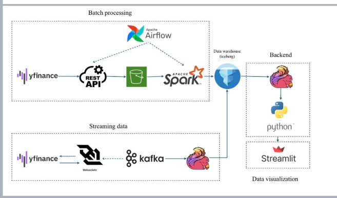

# Stock analysis
Bigdata project for a system designed to collect, store, analyze, and process stock market data

__System Architecture Pipeline:__


## Project Structure
```
stock_analysis/
├── .env                          # Environment variables (API keys, Kafka configs)
├── .gitignore                    # Git ignore rules
├── requirements.txt              # Python dependencies
├── docker-compose.yml            # Docker services orchestration
├── README.md                     # Project documentation
│
├── images/                       # Documentation images
│   ├── PipeLine.png             # System architecture diagram
│   └── current_pipeline.png     # Current implementation pipeline
│
│
├── jars/                        # External JAR dependencies
│   ├── flink/                   # Flink connectors
│   │   ├── flink-connector-kafka-4.0.1-2.0.jar
│   │   ├── iceberg-flink-runtime-2.1.1_2.12-1.4.2.jar
│   │   ├── flink-avro-2.1.1.jar
│   │   └── avro-1.11.5.jar
│   ├── gcs/                     # Google Cloud Storage connector
│   │   └── gcs-connector-shaded.jar
│   └── kafka-clients-4.0.1.jar  # Kafka client library
│
├── keys/                        # Service account credentials
│   └── bigquery-account.json    # BigQuery authentication key
│
│
│
├── scripts/                     # Main application scripts
│   ├── constant/                # Configuration constants
│   │   ├── stock_code_constant.py     # Vietnam stock symbols (HPG, VIC, etc.)
│   │   └── us_stock_code_constant.py  # US stock symbols (AAPL, GOOGL, etc.)
│   │
│   ├── collect_data/            # Legacy data collection modules
│   │   ├── StockProducer.py     # VNStock producer (polling API)
│   │   └── RealtimeStockProducer.py  # Finnhub producer (WebSocket)
│   │
│   ├── batch/                   # Batch processing jobs
│   │
│   └── streaming/               # Streaming data pipeline
│       ├── config/              # Configuration modules
│       │   ├── settings.py      # Application settings
│       │   ├── kafka_config.py  # Kafka configuration
│       │   ├── kafka_admin.py   # Kafka admin utilities
│       │   ├── bigquery_config.py  # BigQuery configuration
│       │   └── market_message.py   # Message schema definitions
│       │
│       ├── ingestion/           # Data ingestion layer
│       │   ├── main.py          # Ingestion entry point
│       │   ├── finnhub_client.py    # Finnhub WebSocket client
│       │   ├── vnstock_client.py    # VNStock API client
│       │   └── kafka_producer.py    # Kafka producer wrapper
│       │
│       ├── processing/          # Data processing layer (Flink)
│       │   ├── main.py          # Processing entry point
│       │   ├── flink_job.py     # Flink streaming job
│       │   ├── schemas.py       # Pydantic data models
│       │   ├── parser.py        # Message parsing utilities
│       │   └── bigquery_sink.py # BigQuery sink implementation
│       │
│       ├── FinnhubFlinkToBigQuery.java  # Java Flink job (alternative)
│       ├── finnhub_spark_to_gcs.py      # Spark streaming job
│       └── vnstock_spark_to_gcs.py      # VNStock Spark job
│
├── tests/                       # Test scripts
│   ├── test_vnstock_producer.py # VNStock API integration tests
│   └── yfinance_test.py         # Yahoo Finance API tests
│
├── stock_api/                   # API utilities and demos
│   ├── demo.ipynb               # Jupyter notebook for API testing
│   └── readme.md                # Stock API documentation
│
├── airflow/                     # Apache Airflow (optional orchestration)
│   ├── airflow.cfg              # Airflow configuration
│   └── dags/                    # Airflow DAGs
│
└── references/                  # Reference materials and example projects
    ├── README.md                # References overview
    ├── BigData_Tools_Frameworks.md
    ├── Finance-Data-Ingestion-Pipeline-with-Kafka/
    ├── financial-market-data-analysis/
    └── finnhub-streaming-data-pipeline/
```

## System

### Components
- **Data Sources**: 
  - Vnstock API (Vietnam stock market - VCI/TCBS/MSN,...)
  - Finnhub API (US stock market - WebSocket real-time)
  
- **Message Broker**: Apache Kafka 
  
- **Data Processing**: Apache Spark and Apache Flink - In development

- **DataLake**: Google Cloude Storage Bucket

- **DataWarehouse**: Google Bigquery

### Stock Codes
Currently tracking Vietnamese stocks (_vnstock_) and US stocks (_finnhub_)

## Installation
Download `.jar' connectors:
Download gcs-connector and save to folder `jars`
```
mkdir -p jars && wget https://repo1.maven.org/maven2/com/google/cloud/bigdataoss/gcs-connector/hadoop3-2.2.11/gcs-connector-hadoop3-2.2.11-shaded.jar -O jars/gcs-connector-shaded.jar
```
Download iceberg-spark-runtime 
```
wget -q -O jars/iceberg-spark-runtime-3.3_2.12-1.4.2.jar     https://repo1.maven.org/maven2/org/apache/iceberg/iceberg-spark-runtime-3.3_2.12/1.4.2/iceberg-spark-runtime-3.3_2.12-1.4.2.jar
```
Download iceberg-flink-runtime
```
wget -q -O jars/flink/iceberg-flink-runtime-2.1.1_2.12-1.4.2.jar     https://repo1.maven.org/maven2/org/apache/iceberg/iceberg-flink-runtime-2.1.1/1.4.2/iceberg-flink-runtime-2.1.1-1.4.2.jar
```
Download flink-sql-connector
```
wget -q -O jars/flink/flink-sql-connector-kafka-3.3.2.jar     https://repo1.maven.org/maven2/org/apache/flink/flink-sql-connector-kafka/3.3.2/flink-sql-connector-kafka-3.3.2.jar
```
```
docker-compose up
```
## Collect data
We offer two methods for collecting data:
- Realtime streaming, using Finnhub API and WebSocket
- Batch polling, using vnstock 

Run python file to collect data by API:
- realtime data by finnhub api:
```
python -m scripts.streaming.ingestion.main
python -m scripts.streaming.processing.main
```
- batch data by vnstock api (crawl automatically after a time period):
```
python -m scripts.collect_data.StockProducer
```

## Utilities
Get Kafka topics 
Using docker Kafka container
```
cd /opt/kafka
bin/kafka-topics.sh --list --bootstrap-server localhost:19092 
```
Get data stored in Kafka topics
```
bin/kafka-console-consumer.sh \
  --bootstrap-server localhost:9092 \
  --topic <Kafka_topic_name> \
  --from-beginning
```

## Spark streaming 
Get data from Kafka topics, analyze and save into Google Cloud Storage


### Finnhub streaming (US stocks - real-time trades)
```
spark-submit \
  --master local[*] \
  --packages org.apache.spark:spark-sql-kafka-0-10_2.12:3.3.2 \
  --jars jars/gcs-connector-shaded.jar \
  scripts/streaming/finnhub_kafka_to_gcs.py \
  --bucket-name stock_data_demo \
  --gcs-key ~/gcs_bigdatastockanalysis.json
```

### VNStock streaming (Vietnam stocks - OHLCV data)
```
spark-submit \
  --master local[*] \
  --packages org.apache.spark:spark-sql-kafka-0-10_2.12:3.3.2 \
  --jars jars/gcs-connector-shaded.jar \
  scripts/streaming/vnstock_kafka_to_gcs.py \
  --bucket-name stock_data_demo \
  --gcs-key ~/gcs_bigdatastockanalysis.json \
  --kafka-topic vnstock_stock \
  --window-duration "5 minutes"
```

### GCS Output Structure
```
gs://stock_data_demo/
├── stock_data/                  # Finnhub data
│   ├── raw/trades/
│   │   └── symbol=AAPL/
│   └── aggregates/ohlcv/
│       └── symbol=AAPL/
│
└── vnstock_data/                # VNStock data
    ├── raw/ohlcv/
    │   └── symbol=HPG/
    └── aggregates/ohlcv/
        └── symbol=HPG/
```

---

## Data Ingestion Layer - Design & Architecture

### Overview
Module `scripts/streaming/ingestion` chịu trách nhiệm thu thập dữ liệu thời gian thực từ các nguồn tài chính bên ngoài và đẩy vào Apache Kafka để phục vụ các bước xử lý downstream. Thiết kế theo kiến trúc modular, mỗi nguồn dữ liệu có client riêng biệt, dễ dàng mở rộng và bảo trì.

### Architecture Components

**1. Entry Point - main.py**

File `main.py` đóng vai trò điểm khởi động chính của pipeline ingestion. Module này thực hiện các nhiệm vụ quan trọng: khởi tạo Kafka topic nếu chưa tồn tại thông qua hàm `create_topic_if_not_exists()`, đảm bảo hạ tầng message broker sẵn sàng trước khi streaming data. Sau đó, module khởi động Finnhub WebSocket client để thiết lập kết nối real-time với thị trường chứng khoán Mỹ. Thiết kế cho phép mở rộng bằng cách bổ sung VNStock polling client chạy song song trên background thread, hỗ trợ thu thập đồng thời từ nhiều nguồn mà không ảnh hưởng performance.

**2. Finnhub Real-time Client - finnhub_client.py**

Module `finnhub_client.py` triển khai kết nối WebSocket với Finnhub API để nhận dữ liệu giao dịch thời gian thực. Sử dụng asyncio và websockets library, client tự động subscribe danh sách mã chứng khoán được truyền vào từ constant configuration. Mỗi khi nhận được trade data từ WebSocket, module parse JSON message, chuẩn hóa theo schema `MarketMessage` thông qua hàm `create_finnhub_message()`, sau đó gọi `send_message()` để đẩy vào Kafka topic. Một điểm mạnh của thiết kế là khả năng tự phục hồi: khi connection bị đứt (do network hoặc API issue), client tự động reconnect sau một khoảng thời gian delay (mặc định 5 giây), đảm bảo tính liên tục của data pipeline. Logging chi tiết giúp monitoring và troubleshooting hiệu quả.

**3. Kafka Producer Wrapper - kafka_producer.py**

Module `kafka_producer.py` đóng gói logic gửi message vào Kafka, tạo abstraction layer giúp các client khác không cần quan tâm chi tiết Kafka configuration. Producer được khởi tạo một lần duy nhất với config từ `kafka_config` (bootstrap servers, compression, retry policy...) và sử dụng JSON serializer để convert Python dict sang bytes. Hàm `send_message(topic, message)` thực hiện gửi data và gọi `flush()` để đảm bảo message được commit ngay lập tức, quan trọng cho real-time streaming. Exception handling toàn diện với logging giúp phát hiện lỗi network hoặc broker unavailable mà không làm crash toàn bộ pipeline.

**4. VNStock Polling Client - vnstock_client.py**

Module `vnstock_client.py` triển khai pattern thu thập dữ liệu theo chu kỳ (polling) cho thị trường Việt Nam. Khác với Finnhub real-time WebSocket, VNStock sử dụng REST API do đó cần polling định kỳ. Hàm `fetch_vnstock(symbol)` gọi API endpoint, parse response JSON và construct `MarketMessage` object với các trường như price, open, high, low, close, volume. Data sau đó được gửi vào Kafka thông qua `send_message()`. Hàm `start_vnstock_polling(symbols, interval_sec)` chạy infinite loop, lặp qua danh sách symbols và sleep theo interval để tránh rate limiting. Thiết kế này phù hợp cho các nguồn dữ liệu không hỗ trợ streaming, có thể chạy song song với Finnhub client trên background thread.

### Design Principles

**Modularity & Separation of Concerns**: Mỗi nguồn dữ liệu (Finnhub, VNStock) được tách thành module riêng, tuân theo Single Responsibility Principle. Kafka producer được abstract thành module độc lập, dễ dàng swap implementation hoặc thêm features như batching, compression.

**Configuration Management**: Tất cả config (API keys, broker address, topic names) được quản lý tập trung qua `settings.py` và load từ `.env` file, tuân theo 12-factor app methodology. Điều này giúp dễ dàng deploy lên các môi trường khác nhau (dev, staging, prod) mà không cần sửa code.

**Error Handling & Resilience**: Mỗi module đều có comprehensive error handling với try-except blocks, logging chi tiết exception stack trace. Finnhub client có auto-reconnect mechanism, VNStock client có timeout config. Producer có retry policy để xử lý transient failures.

**Scalability**: Thiết kế cho phép horizontal scaling bằng cách chạy nhiều instance của ingestion service, mỗi instance subscribe một subset của symbols. Kafka partitioning đảm bảo load balancing và parallel processing ở downstream.

**Observability**: Logging được cấu hình với levels (DEBUG, INFO, ERROR) và structured format, dễ dàng integrate với monitoring tools như ELK stack, Grafana. Mỗi message gửi vào Kafka đều được log để audit trail.

### Data Flow

Data flow trong ingestion layer tuân theo pipeline: External API → Client Module → Message Construction → Kafka Producer → Kafka Topic. Finnhub WebSocket nhận trade events real-time, parse thành `MarketMessage`, gửi vào topic `market_stream`. VNStock polling fetch data theo chu kỳ, construct message tương tự, gửi vào cùng topic hoặc topic riêng tùy config. Downstream consumers (Flink, Spark) subscribe Kafka topic để xử lý tiếp.

---

## Data Processing Layer - Design & Architecture

### Overview
Module `scripts/streaming/processing` chịu trách nhiệm xử lý dữ liệu streaming từ Kafka, thực hiện transformation, validation, và ghi kết quả vào BigQuery. Sử dụng Apache Flink làm streaming engine, thiết kế hướng tới low-latency, exactly-once semantics, và khả năng scale horizontally.

### Architecture Components

**1. Job Entry Point - main.py**

File `main.py` là entry point đơn giản gọi hàm `kafka_to_bigquery_job()` từ module `flink_job.py`. Thiết kế tách biệt giúp dễ dàng testing và orchestration: có thể import job function để chạy từ unit test hoặc Airflow DAG mà không cần execute trực tiếp script. Module này cũng có thể mở rộng để parse command-line arguments cho job configuration override.

**2. Flink Streaming Job - flink_job.py**

Module `flink_job.py` là core của processing pipeline, chứa toàn bộ logic Flink streaming job. Job bắt đầu bằng việc khởi tạo `StreamExecutionEnvironment`, load Kafka connector JARs từ thư mục `jars/` với absolute path để tránh classpath issues. Parallelism được config động: nếu chạy standalone mode (local testing) thì set parallelism=1, nếu chạy trên cluster thì query số partitions của Kafka topic và set parallelism tương ứng để maximize throughput. 

Kafka source được config với `KafkaSource.builder()`, chỉ định bootstrap servers, topic name, consumer group ID, và starting offset strategy (earliest để replay toàn bộ data nếu cần). Deserializer sử dụng `SimpleStringSchema` để đọc message dưới dạng raw string JSON. Watermark strategy set là `no_watermarks()` do không cần event-time processing cho use case hiện tại (có thể nâng cấp sau để support windowing aggregations).

Transform pipeline gồm các bước: nhận raw JSON string từ Kafka, parse thành `MarketMessageModel` object thông qua `parse_market_message()`, validate các fields quan trọng (ví dụ price > 0), filter bỏ invalid messages. Output type được set là `PICKLED_BYTE_ARRAY` để Flink có thể serialize Python objects giữa các operators. Filter operation loại bỏ messages trả về None (tức là parse hoặc validation failed).

Sink operation ghi dữ liệu vào BigQuery nếu flag `ENABLE_BIGQUERY` được bật trong settings. Sử dụng `BigQuerySinkMapFunction` - một custom MapFunction chứa logic gọi BigQuery Streaming API để insert rows. Map function được prefer hơn add_sink() do PyFlink limitations với custom Python sinks.

**3. Data Schema - schemas.py**

Module `schemas.py` định nghĩa Pydantic models cho message schema, đảm bảo type safety và validation. `MarketMessageModel` chứa các fields: message_id (unique identifier), source (finnhub/vnstock), data_type (trade/quote), symbol, timestamp, price fields (open/high/low/close), volume, và nested dicts cho raw_data và metadata. Pydantic tự động validate data types, required fields, và có thể config custom validators (ví dụ: price phải dương). Model này serve như single source of truth cho message format, được sử dụng bởi cả ingestion và processing layers, đảm bảo consistency across pipeline.

**4. Message Parser - parser.py**

Module `parser.py` chứa utilities để parse và transform messages. Hàm `parse_market_message(msg_str)` nhận raw JSON string từ Kafka, parse thành dict, extract nested fields từ `data` và `meta` objects, flatten structure, sau đó construct `MarketMessageModel` instance với Pydantic validation. Nếu parse hoặc validation fail, raise ValueError với descriptive message để logging và debugging.

Hàm `serialize_for_bigquery(msg)` thực hiện post-processing để serialize message cho BigQuery insertion. Datetime objects được convert sang ISO format strings, nested dicts (metadata, raw_data) được JSON-stringify để phù hợp với BigQuery JSON column type. Function này ensure data compatibility với BigQuery schema mà không cần manual column mapping.

**5. BigQuery Sink - bigquery_sink.py**

Module `bigquery_sink.py` triển khai custom sink để ghi dữ liệu vào BigQuery. Class `BigQuerySink` init BigQuery client với service account credentials từ file JSON trong thư mục `keys/`, construct table ID với format `project.dataset.table`. Method `insert(msg)` gọi `insert_rows_json()` API để streaming insert, handle errors và log chi tiết.

Class `BigQuerySinkMapFunction` kế thừa Flink's `MapFunction` interface, triển khai các methods: `open()` để init resources khi worker start, `map(value)` để process từng record. Trong `map()`, value được serialize qua `serialize_for_bigquery()`, insert vào BigQuery, log kết quả, và return value để có thể chain thêm operators nếu cần. Thiết kế này đảm bảo mỗi Flink worker có BigQuery client instance riêng, tránh serialization issues với shared state.

### Design Principles

**Streaming-First Architecture**: Pipeline được thiết kế cho continuous processing, không batch accumulation. Mỗi message được process independently và ghi vào BigQuery ngay lập tức, achieve sub-second latency từ Kafka đến warehouse.

**Fault Tolerance**: Flink checkpoint mechanism (có thể enable thông qua config) đảm bảo exactly-once processing semantics. Nếu job fail và restart, Flink tự động resume từ last checkpoint, không bị duplicate hoặc data loss. BigQuery streaming insert có at-least-once guarantee, combined với Flink deduplication có thể achieve end-to-end exactly-once.

**Type Safety & Validation**: Sử dụng Pydantic models đảm bảo strong typing và runtime validation. Invalid messages được filter early trong pipeline, tránh propagate bad data vào warehouse. Validation errors được log chi tiết để investigate data quality issues.

**Configuration-Driven**: Job behavior được control hoàn toàn qua settings: BigQuery project/dataset/table, Kafka topic, parallelism mode, enable/disable sinks. Không cần code changes để switch giữa environments hoặc toggle features.

**Observability & Monitoring**: Comprehensive logging ở mỗi stage của pipeline. Flink Web UI cung cấp metrics về throughput, latency, backpressure. BigQuery insert errors được log và có thể alert qua monitoring system.

**Modularity & Testability**: Mỗi component (parser, sink, schema) có thể test independently. Mock BigQuery client để unit test sink logic mà không cần actual GCP project. Parse functions có thể test với sample JSON messages.

### Data Flow

Processing pipeline flow: Kafka Topic → Flink Kafka Source → JSON Parse → Pydantic Validation → Filter Invalid → Serialize for BigQuery → BigQuery Streaming Insert. Mỗi bước transform data closer to warehouse schema, ensure quality, và maintain lineage. Failed messages không crash pipeline mà được log để later investigation. Successful messages xuất hiện trong BigQuery table trong vòng vài giây sau khi publish vào Kafka.

### Performance Considerations

Pipeline được optimize cho throughput và latency: Kafka partitioning enable parallel consumption, Flink parallelism match partition count để maximize resource utilization. BigQuery streaming insert có quota limits (10,000 rows/second per table), monitor insertion rate để tránh throttling. Có thể enable micro-batching trong sink để reduce API calls mà vẫn maintain low latency. Serialization overhead được minimize bằng cách avoid unnecessary object copies.

---

## Conclusion

Hệ thống Stock Analysis được thiết kế theo kiến trúc microservices, tách biệt rõ ràng giữa data ingestion, processing, và storage layers. Ingestion layer đảm bảo data freshness và availability, processing layer đảm bảo quality và transformation, storage layer (BigQuery) đảm bảo scalability và analytics capabilities. Architecture này support future enhancements như adding more data sources, complex event processing với windowing, machine learning feature engineering, và real-time dashboards.
